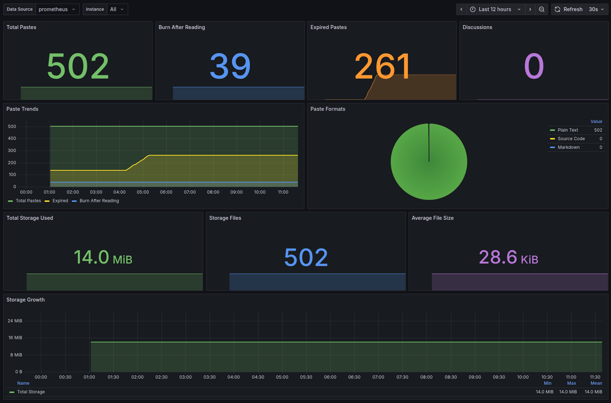

# PrivateBin Docker

A secure Docker container running PrivateBin with Apache web server, featuring Prometheus metrics, data persistence, and optimized configuration for production deployments.

## Features

- **Apache 2.4** with PHP 8.2 (Debian-based)
- **PrivateBin** version 2.0.3
- Optimized image size (~450-500MB)
- Secure setup with sensitive directories outside document root (`/srv/privatebin`)
- **Prometheus metrics** endpoint at `/metrics`
- Security headers configured
- Data persistence with Docker volumes
- Configuration and data mounted as volumes

## Quick Start

### Using Pre-built Image from Docker Hub

```bash
# Pull the image
docker pull itefixnet/privatebin

# Run with Docker (with volume mounts)
docker run -d -p 8080:80 \
  -v ./data:/srv/privatebin/data \
  -v ./conf.php:/srv/privatebin/cfg/conf.php:ro \
  --name privatebin itefixnet/privatebin
```

### Build and Run Locally

```bash
# Build the image
docker build -t privatebin-apache .

# Run with Docker (with volume mounts)
docker run -d -p 8080:80 \
  -v ./data:/srv/privatebin/data \
  -v ./conf.php:/srv/privatebin/cfg/conf.php:ro \
  --name privatebin privatebin-apache
```

Access PrivateBin at: `http://localhost:8080`

## Configuration

### Volume Mounts

The data directory must be mounted as a volume. Optionally mount a custom `conf.php`:

```bash
# Create data directory
mkdir -p data

# Copy sample configuration (optional)
cp conf.php my-conf.php
# Edit my-conf.php as needed

# Set permissions
chmod 770 data
```

Then mount them when running:

```bash
docker run -d -p 8080:80 \
  -v ./data:/srv/privatebin/data \
  -v ./my-conf.php:/srv/privatebin/cfg/conf.php:ro \
  --name privatebin privatebin-apache
```

Or run without custom config to use defaults:

```bash
# Using Docker Hub image
docker run -d -p 8080:80 \
  -v ./data:/srv/privatebin/data \
  --name privatebin itefixnet/privatebin

# Or using locally built image
docker run -d -p 8080:80 \
  -v ./data:/srv/privatebin/data \
  --name privatebin privatebin-apache
```

### Environment Variables

Customize the container by setting environment variables:

- `TZ`: Timezone (default: UTC)
- `METRICS_ALLOWED_IPS`: Space-separated list of IP addresses allowed to access `/metrics` endpoint

Example:

```bash
docker run -d -p 8080:80 \
  -e TZ=America/New_York \
  -e METRICS_ALLOWED_IPS="10.0.1.5 192.168.1.10" \
  -v ./data:/srv/privatebin/data \
  -v ./my-conf.php:/srv/privatebin/cfg/conf.php:ro \
  --name privatebin itefixnet/privatebin
```

### Apache Configuration

The Apache configuration in `apache-config.conf` includes:
- Security headers (CSP, X-Frame-Options, etc.)
- Access restrictions for data directory
- URL rewriting support

## Building

### Default Build

```bash
docker build -t privatebin-apache .
```

### Specify PrivateBin Version

You can build with a specific PrivateBin version using the `PRIVATEBIN_VERSION` build argument:

```bash
docker build --build-arg PRIVATEBIN_VERSION=2.0.3 -t privatebin-apache .
```

Available versions can be found at: https://github.com/PrivateBin/PrivateBin/releases

## Docker Management

### Start the container

```bash
docker start privatebin
```

### Stop the container

```bash
docker stop privatebin
```

### View logs

```bash
docker logs -f privatebin
```

### Rebuild and restart

```bash
docker stop privatebin
docker rm privatebin
docker build -t privatebin-apache .
docker run -d -p 8080:80 \
  -v ./data:/srv/privatebin/data \
  -v ./my-conf.php:/srv/privatebin/cfg/conf.php:ro \
  --name privatebin privatebin-apache
```

## Prometheus Metrics

The container exposes Prometheus-compatible metrics at `/metrics` endpoint.

### Available Metrics

**Paste Statistics:**
- `privatebin_pastes_total` - Total number of pastes
- `privatebin_pastes_expired` - Number of expired pastes
- `privatebin_pastes_burn_after_reading` - Number of burn-after-reading pastes
- `privatebin_discussions_total` - Number of discussions

**Format Statistics:**
- `privatebin_pastes_plaintext` - Number of plain text pastes
- `privatebin_pastes_sourcecode` - Number of source code pastes
- `privatebin_pastes_markdown` - Number of markdown pastes

**Storage Statistics:**
- `privatebin_storage_bytes` - Total storage used in bytes
- `privatebin_storage_files` - Total number of files in data directory
- `privatebin_storage_average_file_bytes` - Average file size in bytes

### Access Control

The metrics endpoint is protected by IP whitelist. Configure allowed IPs using the `METRICS_ALLOWED_IPS` environment variable:

```bash
docker run -d -p 8080:80 \
  -e METRICS_ALLOWED_IPS="10.0.1.5 192.168.1.100" \
  -v ./data:/srv/privatebin/data \
  --name privatebin itefixnet/privatebin
```

**Note:** Localhost (127.0.0.1) is always allowed. If `METRICS_ALLOWED_IPS` is not set, the metrics endpoint will be denied to all external requests.

### Prometheus Configuration

Add to your `prometheus.yml`:

```yaml
scrape_configs:
  - job_name: 'privatebin'
    static_configs:
      - targets: ['privatebin-host:8080']
    metrics_path: '/metrics'
    scrape_interval: 30s
```

### Grafana Dashboard



A pre-built Grafana dashboard is available in `grafana-dashboard.json`. Import it into Grafana to visualize:
- Paste trends and statistics
- Storage usage and growth
- Format distribution
- Real-time metrics

To import:
1. Open Grafana
2. Go to Dashboards → Import
3. Upload `grafana-dashboard.json`
4. Select your Prometheus data source

## Security Considerations

1. **HTTPS**: Use a reverse proxy (nginx, Traefik, Caddy) for HTTPS in production
2. **Data Directory**: Ensure proper permissions (770) and ownership
3. **Updates**: Regularly update to the latest PrivateBin version
4. **Configuration**: Review and customize `conf.php` for your security requirements

## Production Deployment

For production, use a reverse proxy with HTTPS:

```bash
# Run with restart policy and custom network
docker network create proxy

docker run -d \
  --name privatebin \
  --restart unless-stopped \
  --network proxy \
  -e TZ=America/New_York \
  -e METRICS_ALLOWED_IPS="10.0.1.5" \
  -v ./data:/srv/privatebin/data \
  -v ./my-conf.php:/srv/privatebin/cfg/conf.php:ro \
  itefixnet/privatebin
```

Then configure your reverse proxy (nginx, Traefik, Caddy, etc.) to handle HTTPS and forward to the container.

## Troubleshooting

### Permission Issues

```bash
# Fix data directory permissions
sudo chown -R 33:33 data/
chmod 770 data/
```

### Check Logs

```bash
docker logs privatebin
# or follow logs
docker logs -f privatebin
```

### Verify Apache Configuration

```bash
docker exec privatebin-apache apache2ctl -t
```

## License

This project is licensed under the BSD 2-Clause License - see the [LICENSE](LICENSE) file for details.

PrivateBin itself is licensed under the Zlib/libpng license. See the [PrivateBin repository](https://github.com/PrivateBin/PrivateBin) for details.

## Resources

- [Docker Hub](https://hub.docker.com/r/itefixnet/privatebin)
- [PrivateBin Official Site](https://privatebin.info/)
- [PrivateBin GitHub](https://github.com/PrivateBin/PrivateBin)
- [PrivateBin Documentation](https://github.com/PrivateBin/PrivateBin/wiki)
